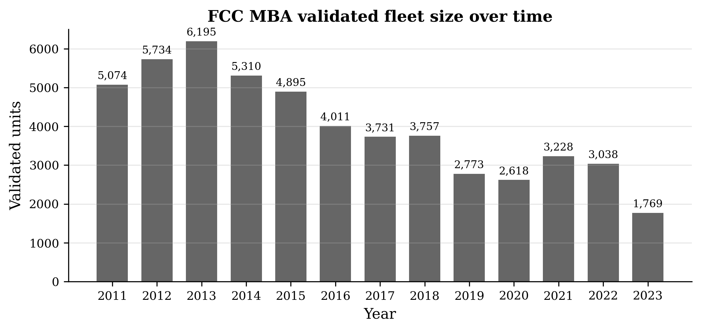
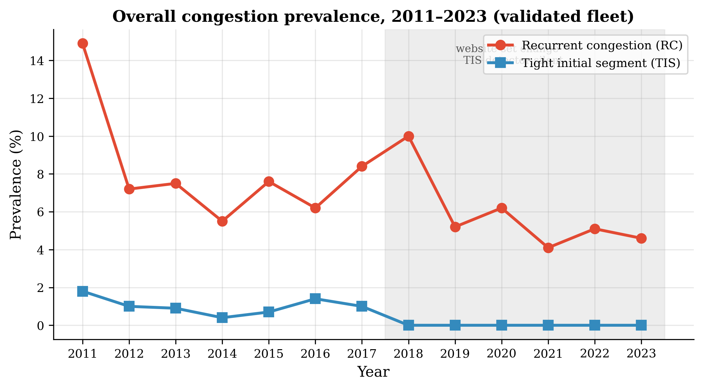
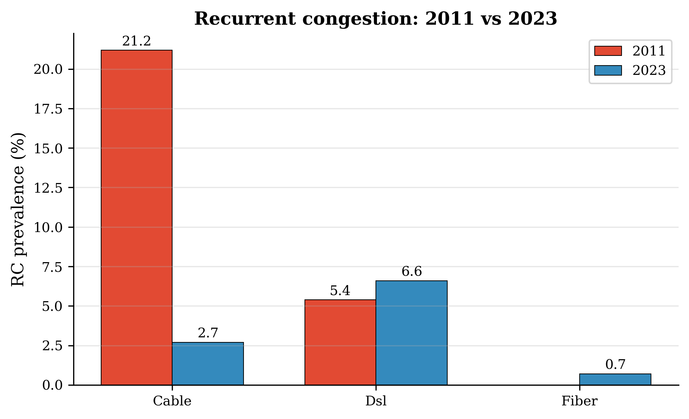
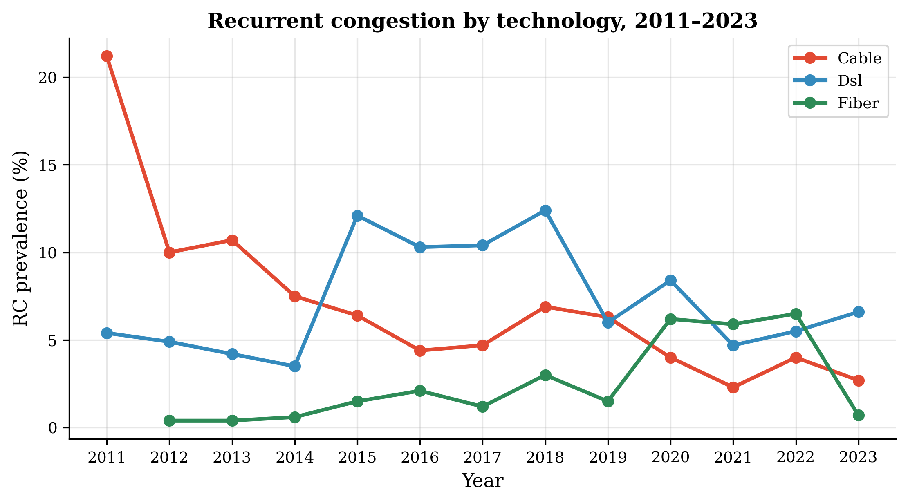
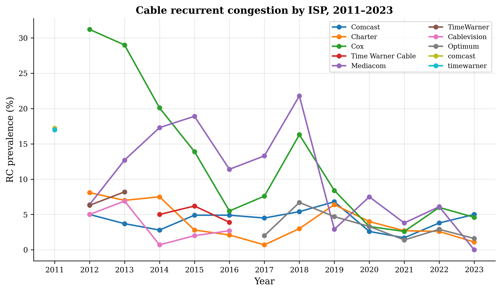
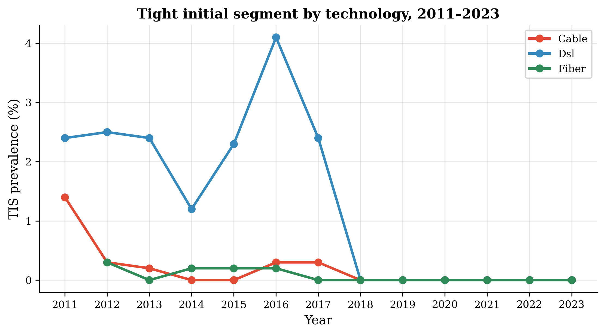
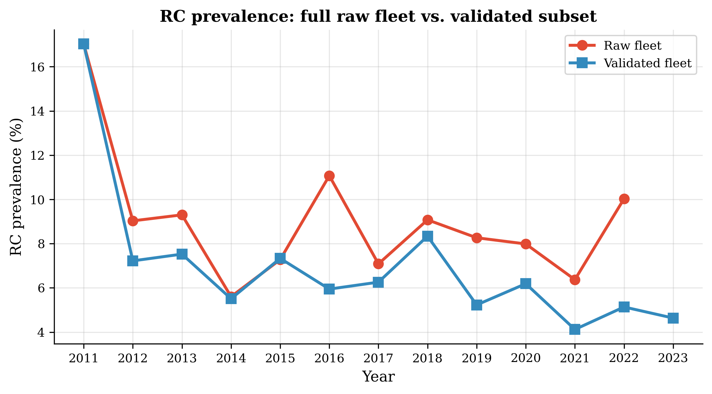

# 1. Introduction

A residential broadband connection is two very different networks joined at a
point of demarcation. The *initial segment* is the access network the ISP
controls: the modem, the last-mile copper or fiber, and the aggregation
equipment between the subscriber and the ISP's edge. Everything past that edge
--- transit, peering, and the public Internet --- is *beyond the initial
segment* (Genin & Splett, 2013). Where a bottleneck sits matters enormously.
Congestion on the initial segment is something an ISP can and must fix with
capacity in its own plant; congestion beyond it implicates interconnection,
peering policy, and the shared public Internet.

In 2013, Genin and Splett used FCC/SamKnows panel data from March 2011 to
measure both. Their two diagnostics:

- **Recurrent congestion (RC):** the throughput a unit actually sustains is
  often below 80% of its speed tier.
- **Tight initial segment (TIS):** load time on *all* of a unit's test websites
  tracks the *benchmark* throughput test closely, implying the bottleneck is on
  the access link itself, not a remote site.

Their finding: cable access was the congested technology (27--32% RC) and its
congestion sat on the initial segment, while DSL congestion was less frequent
but more likely to be an initial-segment problem.

We reproduce their method and extend it across **thirteen years** (2011--2023)
of the FCC's measurement program. This is possible because the program ran for
a decade, letting us watch a generation of capacity investment happen. The
result is a before/after picture of the Internet's congestion structure --- and
an argument for why the trends matter now.

# 2. Data and methods

## 2.1 Data

We use FCC Measuring Broadband America (SamKnows) data: whitebox probes in US
homes running a benchmark throughput test (against M-Lab) and load-time tests
against a rotating set of popular websites, every hour, every day. For each
analysis year we take one collection month: **March 2011, April 2012, and
September 2013--2023**. Two data products are available per year:

- the **validated fleet** — FCC's cleaned, filtered panel (the smaller,
  curated population used in our trend analysis); and
- the **raw bulk** — the full measurement population, which we ingest and run
  the identical pipeline on for 2011--2022.

The validated fleet shrank dramatically over time (Figure 6), so the raw run is
the key check that later-year prevalence is not an artifact of a shrinking,
selected panel.

## 2.2 Pipeline

For each unit-month we: (1) estimate the speed tier from the median daily
maximum sustained throughput; (2) align each benchmark test with the nearest
website load-time test; (3) mark **RC** true when the unit spends >20% of
measurements below 80% of its tier; (4) mark **TIS** true when ≥5 of the 10
website correlations with benchmark throughput exceed r = 0.6. The raw ingest
drops failed tests and median-aggregates the ~6 concurrent benchmark sequences
per timestamp, then runs the identical RC/TIS pipeline. All 13 years use the
same completeness filter so the comparison is consistent.

# 3. Results

## 3.1 A structural change in where congestion lives

The first and most important result is the collapse of cable recurrent
congestion. In March 2011, 21% of cable units were recurrently congested; by
2017--2023 that number is 2--7% (Figure 1, Figure 7). This is not a re-baselining
artifact: advertised cable tiers rose roughly **7×** (median ~17 → ~120 Mbps)
over the same period. Congestion fell while the target got seven times harder.

The second result is that **DSL, not cable, became the persistently congested
technology** (Figure 2). DSL RC hovers at 3--8% and bumps to 10--12% in
2015--2018. DSL tiers rose only ~3.7× (3 → 11 Mbps) versus cable's 7×. The
technology that was hardest to upgrade --- legacy copper --- is the one that
kept its congestion. The paper's core asymmetry (cable ≫ DSL for RC) has
inverted.

The collapse is industry-wide, not a single operator cleaning house: every
major cable ISP improved (Figure 4), led by Cablevision (74% → ~0), Cox
(46% → 8%), and Mediacom (22% → ~3%). What looked in 2011 like a systemic cable
problem was largely two ISPs failing; a decade of capacity investment fixed it.

## 3.2 The tight initial segment vanished after 2017

The TIS signal (Figure 3) falls to **zero for every technology from 2018**.
We are careful about what this means. A permutation-null validation (2011 vs
2019) shows the detector is not noise — but that most of its 2011 detections
(93 units) were the daily load cycle, and only 18 survive an hour-of-day
correction. The post-2017 zeros are largely a *measurement-program* property:
FCC changed its website set, and benchmark↔website correlations systematically
weakened until no unit crossed the ≥5 threshold.

Nevertheless, the qualitative signal that survives scrutiny is DSL-flavored:
the hour-robust TIS units in 2011 are 17 DSL + 1 cable, and ~47% are also RC
(vs a 5.4% DSL baseline — a ~9× enrichment). The paper's claim that *DSL*
recurrent congestion is more likely to sit on the initial segment holds up as a
small, hour-adjusted effect.

## 3.3 The raw fleet confirms the trends

The validated fleet shrank 5,095 → 1,769 units, which could bias prevalence.
Re-running on the full **raw** population (2011--2022) shows the validated
subset *understates* RC in later years (Figure 5): raw RC runs 1.5--2× the
validated figure (2016: 11.1% vs 5.9%; 2022: 10.0% vs 5.1%). But the *shape*
is identical — the 2011 level is reproduced exactly, and the collapse and the
DSL inversion survive. The trends are not artifacts of fleet selection.

# 4. Why these changes matter

## 4.1 Capacity investment works

The cleanest lesson is economic: the technologies that got upgraded got fixed.
Cable ISPs raised tiers ~7× and cut recurrent congestion ~3--7×. The failure
mode was never exotic — it was simply under-provisioned last-mile plant, and it
yielded to capital. The policy implication is that measured congestion, not
advertised speed, is the honest yardstick for broadband quality, and that
congestion is fixable where the incentive to fix exists.

## 4.2 The Internet's congestion model changed

In 2011, the congestion story was "your ISP's last mile is too small." A decade
later, last-mile cable capacity is generally adequate, and the persistent
congestion has moved to the technologies and segments that did not get
investment (legacy DSL copper) and to problems *beyond* the access network —
transit, peering, and CDN/edge structure. A "where is congestion?" study run
today would find less of it on the access link and more of it at the edges of
the network the ISP doesn't control. The unit of analysis has changed: from
the last mile to the middle mile.

## 4.3 DSL is a continuing public-interest problem

DSL (and the copper that still serves millions) is the persistent problem
child: high RC, slow tier growth, and churn of the fleet out of the panel.
Because copper cannot be cheaply upgraded, its congestion did not get fixed.
For regulators this is the clearest "where to look" signal in the whole
dataset.

## 4.4 Measurement programs age

The TIS detector stopped firing after the website-set change. A method tuned to
2011's test design is blind to 2023's Internet. This is a caution for
longitudinal broadband measurement: detectors must be re-calibrated as the
measurement surface changes, and a zero from an aged detector is not evidence
of a healthy network.

# 5. Limitations

- One collection month per year (March 2011, April 2012, September 2013+);
  month-to-month variation is not captured.
- The validated fleet shrinks and the raw→validated processing changed between
  years; we bound this with the raw-fleet re-run (§3.3).
- TIS post-2017 is a measurement-program artifact; we do not interpret its
  zeros as an absence of initial-segment congestion.
- Speed tiers are estimated from the data (no public tier records), so tier
  ratios (~7×, ~3.7×) are approximate.

# 6. Conclusion

Between the early 2010s and 2023, the general model of where Internet
congestion lives changed materially. In 2011 the answer was "cable's last
mile"; by 2023 it is "DSL copper and beyond the access network." The data
demonstrate that congestion is a measurable, fixable, and *investable*
property of broadband — and that the failure to upgrade DSL has left a
persistent, measurable equity gap. The trends are important because they turn
a one-time snapshot (2011) into a causal story: capacity investment reduced
congestion where applied, and left it intact where not.

---

## References

- Genin, D., & Splett, J. (2013). *Where in the Internet is congestion?*
  arXiv:1307.3696.
- FCC Measuring Broadband America data, 2011--2023.
  <https://data.fcc.gov/download/measuring-broadband-america/>
- This reproduction: <https://github.com/fbs6434-gif/where-congestion-occurs-2013>
